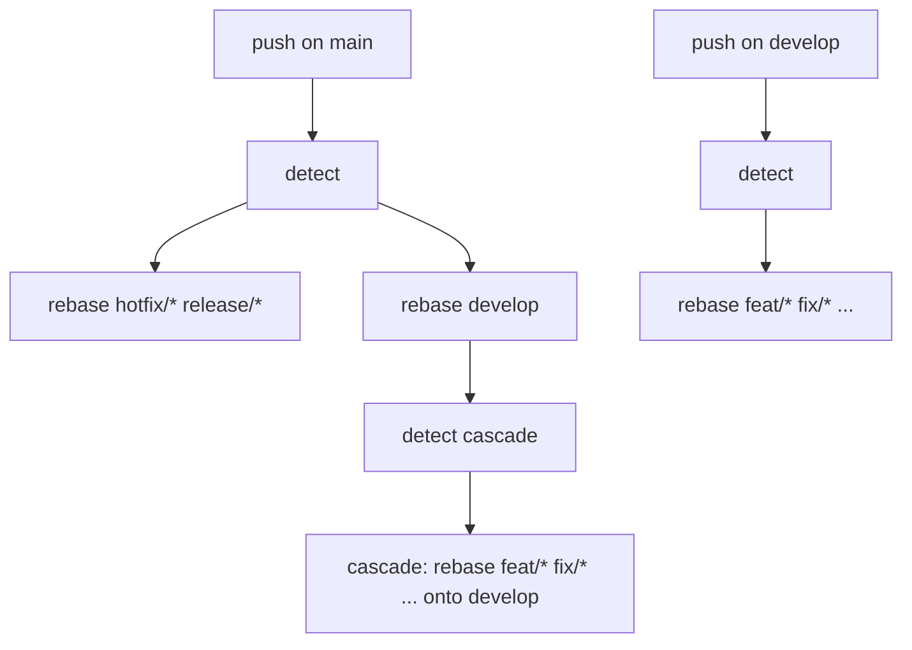

# Rebase downstream branches

A [reusable workflow](https://docs.github.com/en/actions/using-workflows/reusing-workflows) that keeps a git-flow style branch tree linear. Whenever a long lived branch moves, every branch sitting downstream of it is rebased on top of it and force pushed.

Workflow file : [reusable-rebase-downstream-branches.yml](reusable-rebase-downstream-branches.yml)

## Why

In a git-flow repository, `develop` drifts away from `main` as soon as a hotfix lands, and every open feature branch drifts away from `develop` as soon as a pull request is merged. Contributors then discover the drift at merge time, on the branch that is the least convenient to fix.

This workflow moves that cost to the moment the drift is created : the branch that moved triggers the rebase of everything below it, automatically, in parallel, and reports the branches it could not rebase instead of silently leaving them behind.

## How it works



**Tier 1** resolves the branch that moved.

* If it is the production branch (`main` by default), the downstream set is every branch matching `release-prefixes`. The integration branch (`develop` by default) is rebased too, but in a job of its own.
* If it is the integration branch, the downstream set is every branch matching `feature-prefixes`.
* Anything else emits a workflow notice and stops. Calling the workflow from an unrelated branch is a no-op, not a failure.

**Tier 2** is the cascade. When the production branch moved, tier 1 has just moved the integration branch too, so the branches downstream of the integration branch have to follow. The cascade depends on the integration branch job **alone**, so a conflicting release branch cannot block it. It is skipped when `integration-branch` is empty or does not exist on the remote.

Each branch is rebased in its own matrix job with `fail-fast` disabled, so one branch cannot stop its siblings.

### What happens to a branch

1. A branch that holds no commit of its own on top of the base is **left untouched**. Without this guard `git rebase` would fast forward it onto the base tip and force push it, silently turning a merged or empty branch into a moving copy of the base branch.
2. A branch whose rebase ends in a conflict is left untouched on the remote and reported with a `::warning::`. Its matrix job is red, so the run is red.
3. Otherwise the branch is rebased and pushed with `--force-with-lease --force-if-includes`. The lease is taken against the remote-tracking ref written by the checkout of that same job, so a commit pushed to the branch during the run causes the push to be rejected rather than overwritten. A rejected push is reported separately from a conflict, so the warning never sends you to resolve a conflict that does not exist.

### Branch matching

Prefixes are matched **literally** with a `startswith` test against the remote branch names, never expanded as globs. A prefix containing `*` matches nothing rather than expanding against the working tree. Overlapping prefixes such as `feat/` and `feat/sub/` cannot produce two matrix jobs racing on the same branch, and the base branch, the integration branch and `HEAD` are always excluded from the matrix.

## Usage

### Minimal

The defaults describe a standard git-flow repository using [conventional commits](https://www.conventionalcommits.org/) branch prefixes, so most repositories need no input at all.

```yaml
name: Rebase Downstream Branches

on:
  push:
    branches:
      - main
      - develop

permissions:
  contents: write

concurrency:
  group: rebase-${{ github.ref_name }}
  cancel-in-progress: true

jobs:
  rebase:
    uses: LeoShivas/GitOps/.github/workflows/reusable-rebase-downstream-branches.yml@v1
```

**The examples below show only the `jobs:` block that changes.** They all need the same `on:`, `permissions:` and `concurrency:` blocks as above. `permissions: contents: write` is not optional : a called workflow can only lower the permissions granted by its caller, never raise them, so the call fails outright when the caller runs with a read only token.

### Custom branch model

A repository using `master`, `staging` and a single `wip/` prefix :

```yaml
jobs:
  rebase:
    uses: LeoShivas/GitOps/.github/workflows/reusable-rebase-downstream-branches.yml@v1
    with:
      production-branch: master
      integration-branch: staging
      release-prefixes: 'release/'
      feature-prefixes: 'wip/'
```

### Single long lived branch

Set `integration-branch` to an empty string. Only tier 1 runs. In this mode `release-prefixes` no longer means "release branches", it means "every branch that should follow the production branch directly", so that is where the feature prefixes go.

```yaml
on:
  push:
    branches:
      - main

jobs:
  rebase:
    uses: LeoShivas/GitOps/.github/workflows/reusable-rebase-downstream-branches.yml@v1
    with:
      integration-branch: ''
      release-prefixes: 'feature/ fix/'
```

### Triggering workflows on the rebased branches

[Pushes made with `GITHUB_TOKEN` never trigger a workflow run](https://docs.github.com/en/actions/security-for-github-actions/security-guides/automatic-token-authentication#using-the-github_token-in-a-workflow). This is a GitHub guard against infinite workflow loops, and it means the rebased branches will not re-run their CI by default.

Pass a token of your own to opt out :

```yaml
jobs:
  rebase:
    uses: LeoShivas/GitOps/.github/workflows/reusable-rebase-downstream-branches.yml@v1
    secrets:
      token: ${{ secrets.REBASE_PAT }}
```

Use a **fine grained** personal access token scoped to that single repository with `Contents: Read and write`, or a GitHub App installation token. Do not use a classic PAT : its `repo` scope grants write access to every repository the account can reach, and this workflow hands that token to a job that checks out branch content.

Read [Cost and loops](#cost-and-loops) before enabling this : a custom token makes the workflow re-trigger itself through the integration branch.

### Running it on a schedule

On a `schedule` or `workflow_dispatch` run, `GITHUB_REF_NAME` resolves to the repository **default branch**, not to the branch you mean. Omitting `base-branch` there does not produce a harmless no-op, it silently runs the production branch path. Always pass it explicitly :

```yaml
on:
  schedule:
    - cron: '0 3 * * *'

jobs:
  rebase:
    uses: LeoShivas/GitOps/.github/workflows/reusable-rebase-downstream-branches.yml@v1
    with:
      base-branch: develop
```

## Inputs

All inputs are optional.

| Name | Type | Default | Description |
| --- | --- | --- | --- |
| `base-branch` | string | `''`, meaning the ref the caller runs on | Branch that moved and that downstream branches are rebased onto. A leading `refs/heads/` is stripped. Leave it unset on a `push` trigger, set it explicitly on any other trigger. |
| `production-branch` | string | `main` | Long lived branch holding the released code. Release and hotfix branches, and the integration branch, are rebased onto it. |
| `integration-branch` | string | `develop` | Long lived branch holding the next release. Feature branches are rebased onto it. An empty string, or a branch absent from the remote, disables the cascade. |
| `release-prefixes` | string | `hotfix/ release/` | Whitespace separated branch name prefixes rebased onto the production branch. Matched literally. |
| `feature-prefixes` | string | `feat/ fix/ docs/ style/ refactor/ perf/ test/ build/ ci/ chore/ revert/` | Whitespace separated branch name prefixes rebased onto the integration branch. Matched literally. |
| `committer-name` | string | `github-actions[bot]` | Name used for the rebase commits. |
| `committer-email` | string | `github-actions[bot]@users.noreply.github.com` | Email used for the rebase commits. |
| `runs-on` | string | `ubuntu-latest` | A single runner label used by every job. The runner must provide `git` and `jq`. |
| `job-timeout-minutes` | number | `30` | Timeout applied to every rebase job. The two detection jobs are fixed at 10 minutes. |

## Secrets

| Name | Required | Description |
| --- | --- | --- |
| `token` | No | Token used to clone and force push the rebased branches. Defaults to the caller `GITHUB_TOKEN`. See [Triggering workflows on the rebased branches](#triggering-workflows-on-the-rebased-branches). |

## Requirements on the calling repository

* The calling workflow must declare `permissions: contents: write`.
* **This workflow force pushes your integration branch**, not only the prefixed branches. A force push restriction on `develop` will fail that job, and the cascade will not run.
* Branch protection rules must allow force pushes from the identity behind the token in use, on every branch the workflow touches.
* Detection runs on the remote branches, so a branch that only exists locally is ignored.
* The runner must provide `git` and `jq`. Both are present on GitHub hosted Ubuntu runners.
* A repository inside a GitHub organization needs its Actions policy set to allow reusable workflows from outside the organization, otherwise the `uses:` resolves to a permission error rather than to this workflow.

## Behaviour notes

* **Conflicts are not resolved.** The workflow does exactly what `git rebase` does, and gives up when `git rebase` gives up. The branch is left in the state it had before the run, and the job is red so the failure is visible.
* **Rebasing rewrites commits.** Commit signatures are dropped, so a repository requiring signed commits on feature branches will reject every push. Open pull requests get their approvals dismissed when "Dismiss stale pull request approvals" is on, and all their required checks re-run.
* **Concurrency is the caller's responsibility.** The reusable workflow declares no concurrency group, so a repository calling several reusable workflows stays in control of its own grouping. The example above groups by `github.ref_name`, which serializes two pushes on the same branch while letting `main` and `develop` run in parallel.

### Cost and loops

* Each branch is one runner job. A repository with thirty open feature branches starts thirty jobs on every push to the integration branch.
* GitHub caps a matrix at 256 jobs per run. Above that the run fails to start the matrix instead of running partially. The detection jobs emit a warning when they see it coming.
* With the default `GITHUB_TOKEN` the workflow cannot re-trigger itself.
* **With a custom token it does.** Tier 1 force pushes the integration branch, and that push re-triggers the calling workflow on the integration branch, which rebases the same feature branches the cascade of the first run is already rebasing. The two waves race, the loser gets its push rejected, and you get a spurious warning. The suggested `concurrency: rebase-${{ github.ref_name }}` does not serialize them, because the two runs are keyed on different refs. Group on `rebase-${{ github.repository }}` instead if you pass a custom token. The sequence terminates, it does not loop forever, because the second wave only pushes prefixed branches which are not part of the trigger.

## Security

* Every shell step runs with `set -euo pipefail`.
* Branch names, prefixes and every other caller supplied value reach the shell through `env:` bindings, never through `${{ }}` interpolation inside a script body. Branch names are attacker influenceable and `git check-ref-format` accepts `$`, backticks, `;` and `|` in a ref name, so this is what keeps a branch named to look like shell code from executing.
* `base-branch` is validated with `git check-ref-format` before use. It cannot smuggle a second line into `$GITHUB_OUTPUT` and take over the job matrix.
* Prefixes are compared with `startswith`, never expanded as globs or as shell words.
* The workflow declares `permissions: contents: read` by default and raises it to `contents: write` only on the three jobs that push. The two detection jobs also check out with `persist-credentials: false`, so no token is available in the jobs that do not need one.
* `runs-on` is an input, so a consumer can direct these jobs to a self-hosted runner. GitHub advises against self-hosted runners for public repositories, because a compromised job can persist on the machine.

## Versioning

Pin a tag :

```yaml
uses: LeoShivas/GitOps/.github/workflows/reusable-rebase-downstream-branches.yml@v1
```

For a hardened setup, pin the full commit SHA instead. A reusable workflow referenced by a mutable ref executes whatever this repository contains **at the time of your run**, with your `contents: write` token :

```yaml
uses: LeoShivas/GitOps/.github/workflows/reusable-rebase-downstream-branches.yml@<full-commit-sha>
```

Do not reference `@main`.
