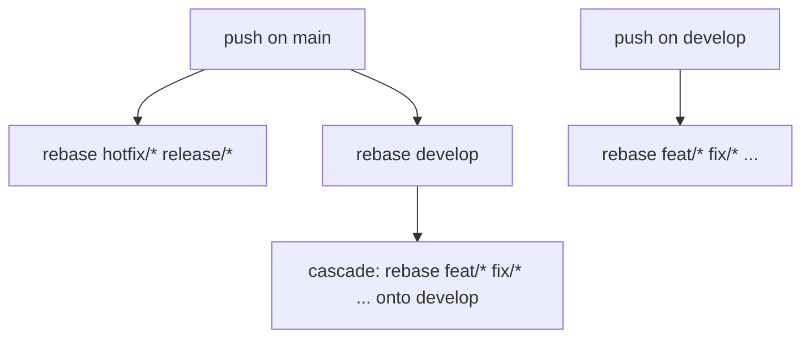

# Rebase downstream branches

A [reusable workflow](https://docs.github.com/en/actions/using-workflows/reusing-workflows) that keeps a git-flow style branch tree linear. Whenever a long lived branch moves, every branch sitting downstream of it is rebased on top of it and force pushed.

Workflow file : [reusable-rebase-downstream-branches.yml](reusable-rebase-downstream-branches.yml)

## Why

In a git-flow repository, `develop` drifts away from `main` as soon as a hotfix lands, and every open feature branch drifts away from `develop` as soon as a pull request is merged. Contributors then discover the drift at merge time, on the branch that is the least convenient to fix.

This workflow moves that cost to the moment the drift is created : the branch that moved triggers the rebase of everything below it, automatically, in parallel, and reports the branches it could not rebase instead of silently leaving them behind.

## How it works



The workflow runs in two tiers.

**Tier 1** resolves the branch that moved.

* If it is the production branch (`main` by default), the downstream set is every branch matching `release-prefixes`, plus the integration branch (`develop` by default) when it exists on the remote.
* If it is the integration branch, the downstream set is every branch matching `feature-prefixes`.
* Anything else emits a workflow notice and stops. Calling the workflow from an unrelated branch is a no-op, not a failure.

**Tier 2** is the cascade. When the production branch moved, tier 1 has just moved the integration branch too, so the branches downstream of the integration branch have to follow. This tier is skipped when `integration-branch` is empty.

Each branch is rebased in its own matrix job with `fail-fast` disabled. A branch whose rebase ends in a conflict is left untouched on the remote, and the job reports a `::warning::` asking for a manual rebase. The other branches of the matrix are still processed.

Pushes use `--force-with-lease`, so a rebase never overwrites a commit that was pushed to the branch after the workflow checked it out.

## Usage

### Minimal

The defaults describe a standard git-flow repository using [conventional commits](https://www.conventionalcommits.org/) branch prefixes, so most repositories need no input at all.

```yaml
name: Rebase Downstream Branches

on:
  push:
    branches:
      - main
      - develop

permissions:
  contents: write

concurrency:
  group: rebase-${{ github.ref_name }}
  cancel-in-progress: true

jobs:
  rebase:
    uses: LeoShivas/GitOps/.github/workflows/reusable-rebase-downstream-branches.yml@main
```

### Custom branch model

A repository using `master`, `staging` and a single `wip/` prefix :

```yaml
jobs:
  rebase:
    uses: LeoShivas/GitOps/.github/workflows/reusable-rebase-downstream-branches.yml@main
    with:
      production-branch: master
      integration-branch: staging
      release-prefixes: 'release/'
      feature-prefixes: 'wip/'
```

### Single long lived branch

Set `integration-branch` to an empty string. Only tier 1 runs, and it rebases the `release-prefixes` branches onto the production branch.

```yaml
on:
  push:
    branches:
      - main

jobs:
  rebase:
    uses: LeoShivas/GitOps/.github/workflows/reusable-rebase-downstream-branches.yml@main
    with:
      integration-branch: ''
      release-prefixes: 'feature/ fix/'
```

### Triggering workflows on the rebased branches

[Pushes made with `GITHUB_TOKEN` never trigger a workflow run](https://docs.github.com/en/actions/security-for-github-actions/security-guides/automatic-token-authentication#using-the-github_token-in-a-workflow). This is a GitHub guard against infinite workflow loops, and it means the rebased branches will not re-run their CI by default.

Pass a personal access token or a GitHub App installation token to opt out :

```yaml
jobs:
  rebase:
    uses: LeoShivas/GitOps/.github/workflows/reusable-rebase-downstream-branches.yml@main
    secrets:
      token: ${{ secrets.REBASE_PAT }}
```

The token needs the `contents: write` permission on the repository. Beware of the loop it enables : a rebase push on a branch matching one of the prefixes does not re-trigger this workflow, because the workflow only triggers on the production and integration branches, but any other workflow listening on those branches will now run.

### Running it on a schedule

The workflow reads the branch that moved from the ref the caller runs on. When there is no such ref, for instance on a `schedule` or a `workflow_dispatch`, pass it explicitly :

```yaml
on:
  schedule:
    - cron: '0 3 * * *'

jobs:
  rebase:
    uses: LeoShivas/GitOps/.github/workflows/reusable-rebase-downstream-branches.yml@main
    with:
      base-branch: develop
```

## Inputs

All inputs are optional.

| Name | Type | Default | Description |
| --- | --- | --- | --- |
| `base-branch` | string | the ref the caller runs on | Branch that moved and that downstream branches are rebased onto. Leave it unset for a `push` trigger. |
| `production-branch` | string | `main` | Long lived branch holding the released code. Release and hotfix branches, and the integration branch, are rebased onto it. |
| `integration-branch` | string | `develop` | Long lived branch holding the next release. Feature branches are rebased onto it. An empty string disables the cascade. |
| `release-prefixes` | string | `hotfix/ release/` | Space separated branch name prefixes rebased onto the production branch. |
| `feature-prefixes` | string | `feat/ fix/ docs/ style/ refactor/ perf/ test/ build/ ci/ chore/ revert/` | Space separated branch name prefixes rebased onto the integration branch. |
| `committer-name` | string | `github-actions[bot]` | Name used for the rebase commits. |
| `committer-email` | string | `github-actions[bot]@users.noreply.github.com` | Email used for the rebase commits. |
| `runs-on` | string | `ubuntu-latest` | Runner label used by every job. |

## Secrets

| Name | Required | Description |
| --- | --- | --- |
| `token` | No | Token used to clone and force push the rebased branches. Defaults to the caller `GITHUB_TOKEN`. See [Triggering workflows on the rebased branches](#triggering-workflows-on-the-rebased-branches). |

## Requirements on the calling repository

* The calling workflow must declare `permissions: contents: write`. A called workflow can only lower the permissions granted by its caller, never raise them, so the call fails outright when the caller runs with a read only token.
* Branch protection rules must allow force pushes from the identity behind the token in use. A protected branch matching one of the prefixes will fail its rebase job and be reported as a warning.
* Detection runs on the remote branches, so a branch that only exists locally is ignored.

## Behaviour notes

* **Conflicts are not resolved.** The workflow does exactly what `git rebase` does, and gives up when `git rebase` gives up. The branch is left in the state it had before the run.
* **The cascade requires tier 1 to succeed.** If any tier 1 rebase job fails, the cascade jobs are skipped. Push again on the production branch once the conflict is resolved to resume it.
* **Concurrency is the caller's responsibility.** The reusable workflow declares no concurrency group, so that a repository calling several reusable workflows stays in control of its own grouping. The example above groups by `github.ref_name`, which serializes two pushes on the same branch while letting `main` and `develop` run in parallel.
* **Cost.** Each branch is one runner job. A repository with thirty open feature branches will start thirty jobs on every push to the integration branch.

## Security

* Every shell step runs with `set -euo pipefail`.
* Branch names and prefixes reach the shell through `env:` bindings, never through `${{ }}` interpolation inside the script body, so a branch named to look like shell code cannot execute.
* The workflow declares `permissions: contents: write` and nothing else.

## Versioning

The examples pin `@main`. Pin a tag or a commit SHA instead if you want to control when you pick up changes :

```yaml
uses: LeoShivas/GitOps/.github/workflows/reusable-rebase-downstream-branches.yml@<tag-or-sha>
```
